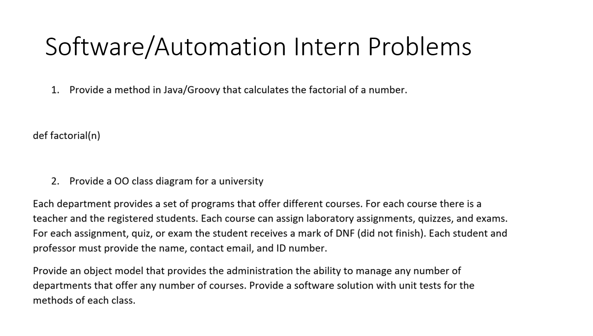

# Synopsys Intern Interview Project

## Task

## Question 1
Created a method that calculates the factorial of a number both iteratively and recursively.

## Question 2
- Created an Object Oriented Class Design for a University. Design allows different departments to offer a Set of Programs. Uses HashMaps to Map any course to its Teacher and the Students rgeistered in that specific course.
- Each course is able to assign lab assignments, quizzes, and exams.
- Students are given a default score of DNF (Did Not Finish) on every task.
- Each Faculty member or Student is made to provide their Name, Email, and Student ID Number.
- The Object Model provides the administration the ability to manage several departments offering any number of courses. 
- Unit Tests are also included for testing methods of each Class.

## Dhruv Arun
### Email: dhruv.arun@gmail.com
### LinkedIn: https://www.linkedin.com/in/dhruvarun/